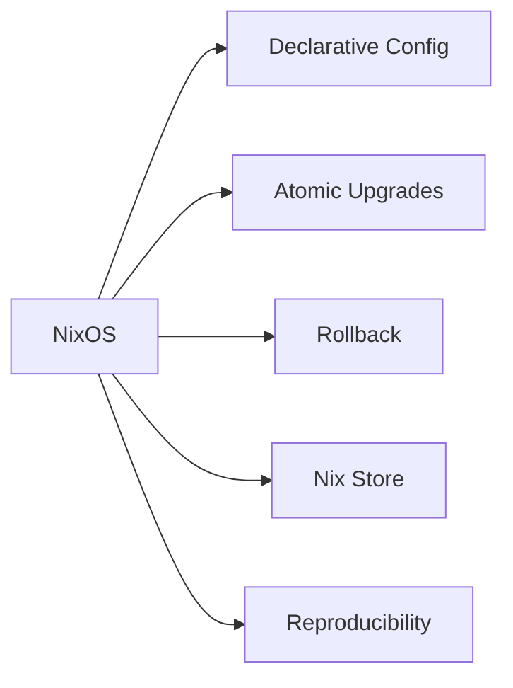

# 🛡️ The Unbreakable System: A NixOS Case Study

*A comprehensive academic case study exploring NixOS, a declarative Linux distribution built on the Nix package manager*

[Overview](#overview) • [Key Topics](#key-topics) • [Performance](#performance-metrics) • [Authors](#authors)

---

## 📋 Overview

This paper provides an in-depth analysis of **NixOS**, examining its purely functional approach to system management and comparing it with traditional Linux methodologies. 

> **Course**: CSCI 312  
> **Institution**: American University of Ras Al Khaimah  
> **Academic Year**: 2024-2025

---

## 🔍 Key Topics

### 🖥️ OS Analysis

| Topic | Description |
|-------|-------------|
| **Process & Thread Management** | Linux kernel's unified task abstraction model |
| **Process Scheduling** | Completely Fair Scheduler (CFS) and red-black tree implementation |
| **Synchronization** | Spinlocks, mutexes, semaphores, and atomic operations |
| **Deadlock Handling** | Prevention strategies including resource ordering and timeouts |
| **Memory Management** | Virtual memory, paging, swapping, and zramSwap |
| **File Management** | Comparison of imperative vs. functional approaches |

### ⚙️ NixOS Features

- **🔧 Declarative Configuration**: Single `configuration.nix` file for entire system
- **⚡ Atomic Upgrades**: System updates are all-or-nothing transactions
- **↩️ Rollback Capability**: Easy reversion to previous configurations
- **📦 Nix Store**: Unique cryptographic hash-based package storage at `/nix/store/`
- **🔄 Reproducibility**: Build recipes (derivations) ensure consistent environments

### ⚖️ Legal and Ethical Considerations

- ✅ Software licensing and FOSS compliance
- 🔒 Data privacy and telemetry concerns
- 🛡️ Security vulnerability handling
- 👥 Governance and community dynamics
- 📁 Non-compliance with Filesystem Hierarchy Standard (FHS)

---

## 🚀 Implementation

The paper includes practical guidance on:

- 💿 Installing NixOS (VM and bare-metal)
- 📊 Resource monitoring with KDE tools
- 🔍 System call tracing using `strace` and `ftrace`

### 📈 Performance Metrics

> Testing on **Intel i5-12450HX** with **28GB RAM**

| Workload | CPU Usage | RAM Usage |
|----------|-----------|-----------|
| 🟢 Idle | 0.7% | 2.9GB |
| 🟡 Average Work | 4% | 6GB |
| 🔴 Stress Test | 95.8% | 25.6GB |

---

## 👥 Authors

<table>
  <tr>
    <td align="center">
      <b>Hazim Kaloub</b> 
      2023005883
    </td>
    <td align="center">
      <b>Adnan Shanbour</b> 
      2022005845
    </td>
    <td align="center">
      <b>Ahmed Gani</b> 
      2022005563
    </td>
  </tr>
</table>

*Additional contributors listed in paper*

---

## 📚 Course Information

| | |
|---|---|
| **Course** | CSCI 312 |
| **Instructor** | Dr. Zubaidah Alhazza |
| **Institution** | American University of Ras Al Khaimh |
| **Academic Year** | 2024-2025 |

---

## 📖 Further Reading

The paper includes references to seminal works by **Eelco Dolstra** and other NixOS/Nix documentation, available in the Further Readings section.

---

## 📄 License

This academic work is subject to university guidelines and copyright policies.

---

**[⬆ back to top](#-the-unbreakable-system-a-nixos-case-study)**

Made with ❤️ for CSCI 312

